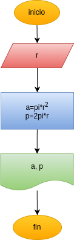

# Programa 1: area_perimetro_circulo
programa en Python para calcular el area y el perimetro de un circulo, dado el valor de su radio.

## Análisis

### Variables de entrada
- r: radio de circulo

### Procesamiento
- a: area del circulo
- p: perimetro del circulo

$a= \pi*r^2$

$p= 2*\pi*r$

## Diseño

## Construcción
- codigo implementado en el archivo area_perimetro_circulo.py
